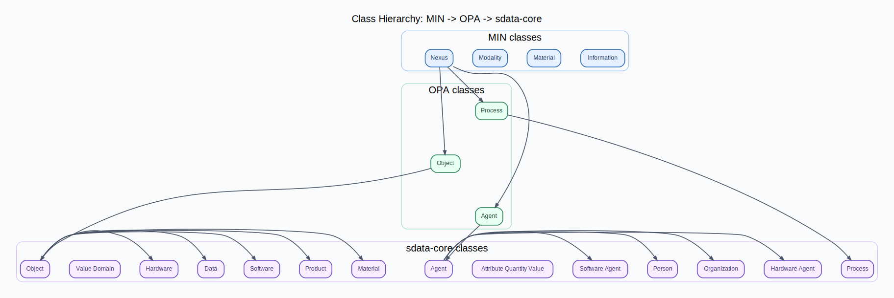

# sdata — Semantic Data Ontology

Ontology suite for Product Passports, Circular Economy, and Digital Twins.

## Status

- Core: `sdata-core-v0.10.0.ttl`
- Foundation: `MIN` + `OPA`
- State Space: `sdata-material-state-v0.5.0.ttl`

## Module overview

- `sdata-core.ttl` (`v0.10.0`)
: 15 classes, 19 object properties, 7 datatype properties.
- `sdata-material-state.ttl` (`v0.5.0`)
: 13 state axes incl. `MethodAxis`, `DomainAxis`, `DataTypeAxis`.
- `shapes/sdata-core-shapes.ttl`
: SHACL checks for example data.

## Core model in 60 seconds

- 3 categories:
  - `sdata:Object`
  - `sdata:Process`
  - `sdata:Agent`
- `sdata:Object` subtypes:
  - `Material`, `Product`, `Hardware`, `Software`, `Data`
- `sdata:Agent` subtypes:
  - `Person`, `HardwareAgent`, `SoftwareAgent`, `Organization`, `EnvironmentAgent`
- `sdata:Process` has no core subclasses in `v0.10.0`.
: method and domain are modeled via `sms:MethodAxis` and `sms:DomainAxis`.

## Core modeling pattern

```text
Product + Data -> Process -> Product + Data
                    ^
                 Agent(s)
             + optional Hardware/Software
```

## Namespaces

```turtle
@prefix sdata: <https://w3id.org/sdata/core/> .
@prefix sms:   <https://w3id.org/sdata/material-state/> .
```

## Quickstart

```bash
make setup
make test
make validate
make lint
```

## Visualizations

Build all ontology plots:

```bash
make viz-all
```

Build cross-ontology class hierarchy (MIN -> OPA -> sdata-core):

```bash
make viz-min-opa-core
```



Build all example plots:

```bash
make viz-examples
```

Build specimen example with dedicated module:

```bash
make viz-specimen
uv run python -m src.visualization.specimen_tensiontest_data_plot
```

## Migration notes (v0.8 -> v0.10.0)

- `Data` moved into `Object` hierarchy.
- Process subclasses removed from core.
: use `sms:MethodAxis` and `sms:DomainAxis` instead.
- `MachineAgent` renamed to `HardwareAgent`.
- `Certificate`/`DigitalProductPass` moved to `sms:DataTypeAxis` concepts.
- `sdata:hasUnit` removed from core datatype properties.
- `EnvironmentAgent` added as 5th agent subtype for non-intentional natural causality.
- `MethodAxis` adds `method.Degradation` with environmental methods (`Corrosion`, `Weathering`, `NaturalAging`, `BiologicalDecay`, `FatigueDamage`).
- Legacy extension ontologies `sdata-agents.ttl`, `sdata-processtypes.ttl`, `sdata-lifecycle.ttl` are removed.

## Documentation

```bash
uv run --group docs mkdocs build
```
