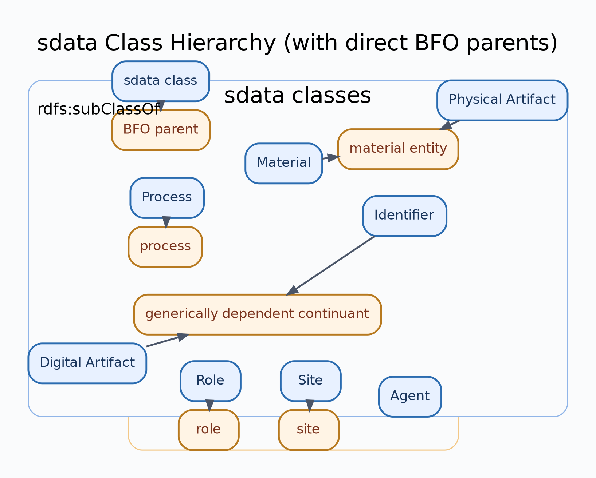

# sdata — Semantic Data Ontology

**Deployment-ready mid-level ontology for Product Passports, Circular Economy & Digital Twins.**

[](https://w3id.org/sdata/core/0.3.0)
[](https://w3id.org/sdata)
[](http://creativecommons.org/publicdomain/zero/1.0/)
[](https://www.w3.org/TR/owl2-overview/)
[-green.svg)](https://basic-formal-ontology.org/bfo-2020.html)
[](https://www.w3.org/TR/prov-o/)
[](http://qudt.org/)
[-brightgreen.svg)](https://www.w3.org/TR/turtle/)

---

## Overview

sdata is a modular ontology suite built on three orthogonal foundations:

| Foundation | Standard | Answers |
|---|---|---|
| **BFO** | ISO/IEC 21838-2:2021 | *What exists?* — categorical grounding |
| **PROV-O** | W3C Recommendation | *Who did what when?* — provenance tracking |
| **QUDT** | QUDT 3.1 | *How much?* — quantities, units, dimensions |

## Namespace

All IRIs resolve via [w3id.org](https://w3id.org):

```
@prefix sdata: <https://w3id.org/sdata/core/> .
```

| Module | IRI | Description |
|---|---|---|
| **Core** | `https://w3id.org/sdata/core` | 12 classes, 15 object properties, 14 datatype properties |
| **Agents** | `https://w3id.org/sdata/vocab/agents` | SKOS ConceptScheme for agent types |
| **Core Shapes** | `https://w3id.org/sdata/core/shapes` | SHACL constraints for core data validation |

## Repository Structure

```
sdata/
├── sdata-core.ttl              Core ontology (v0.3.0)
├── sdata-agents.ttl            SKOS: Agent types
├── sdata-*.ttl
├── shapes/
│   ├── sdata-core-shapes.ttl   SHACL shapes for core validation
├── examples/
│   └── battery-passport.ttl    Example: Battery Passport instance data
├── src/
│   ├── examples/
│   │   └── dpp_01.py           Python example graph builder
│   └── visualization/
│       ├── class_hierarchy_plot.py
│       └── ...
├── vendor/ontologies/
│   ├── bfo.ttl                 Vendored BFO ontology (from official ISO BFO 2020 OWL)
│   ├── prov-o.ttl              Vendored PROV-O ontology
│   ├── qudt.ttl                Vendored QUDT ontology
│   ├── dtype.ttl               Vendored QUDT dependency
│   ├── vaem.ttl                Vendored QUDT dependency
│   └── skos.ttl                Vendored QUDT dependency
├── docs/
│   ├── index.md                MkDocs entry page
│   └── ...
├── tests/
│   ├── test_ontology.py
│   └── ...
├── mkdocs.yml                  MkDocs site configuration
├── uv.lock                     Locked dependency graph for uv
├── LICENSE
└── README.md
```

## SDATA Core Ontology at a Glance

### 12 Classes

| SDATA Class | BFO Superclass | Description |
|---|---|---|
| `Material` | MaterialEntity | Homogeneous material substance |
| `Information` | GenericallyDependentContinuant | Homogeneous information substance |
| `MaterialArtifact` | MaterialEntity | Discrete physical artifact |
| `InformationArtifact` | GenericallyDependentContinuant | Discrete information artifact |
| `MaterialProcess` | Process | Process in material domain |
| `InformationProcess` | Process | Process in information domain |
| `MaterialSite` | Site | Spatial location for material domain |
| `InformationSite` | GenericallyDependentContinuant | Logical location for information domain |
| `MaterialAgent` | MaterialEntity + prov:Agent | Tangible acting entity |
| `InformationAgent` | GenericallyDependentContinuant + prov:Agent | Intangible acting entity |
| `Role` | Role | Orthogonal context role |
| `Identifier` | GenericallyDependentContinuant | Orthogonal typed identifier token |

### Dual Principle

`sdata-core` follows a symmetric dual model:

- **Material side (tangible)**: `MaterialArtifact`, `Material`, `MaterialAgent`, `MaterialProcess`, `MaterialSite`
- **Information side (intangible)**: `InformationArtifact`, `Information`, `InformationAgent`, `InformationProcess`, `InformationSite`

Each material class has a semantic dual on the information side.  
Two classes are intentionally **orthogonal** (domain-spanning): `Role` and `Identifier`.

### Key Design Decisions

- **Flat class hierarchy** — subtype discrimination via SKOS ConceptSchemes, not OWL subclasses
- **PROV-O via property-mapping** — `generates ⊆ prov:generated`, `consumes ⊆ prov:used`, `wasPerformedBy ⊆ prov:wasAssociatedWith` (no dual inheritance)
- **consistsOf vs. hasPart** — material constitution vs. structural BOM hierarchy, strictly separated
- **Dual substance model** — `Material` and `Information` are domain-dual non-discrete substances
- **xsd:dateTimeStamp** — mandatory timezone for global supply chain interoperability
- **Identifier as orthogonal class** — domain-spanning identifier token

## Usage

### SPARQL — find all materials in a product

```sparql
PREFIX sdata: <https://w3id.org/sdata/core/>

SELECT ?product ?material ?materialName WHERE {
  ?product a sdata:MaterialArtifact ;
           sdata:consistsOf ?material .
  ?material sdata:name ?materialName .
}
```

### SPARQL — provenance chain (PROV-O compatible)

```sparql
PREFIX prov: <http://www.w3.org/ns/prov#>

SELECT ?entity ?activity ?agent WHERE {
  ?activity prov:generated ?entity ;
            prov:wasAssociatedWith ?agent .
}
```

## Versioning

Versions follow semantic versioning. Each release is tagged (`v0.3.0`, …).

- **Ontology IRI** (always current): `https://w3id.org/sdata/core`
- **Version IRI** (pinned): `https://w3id.org/sdata/core/0.3.0`

Import the unversioned IRI to track latest, or the versioned IRI to pin.

## Validation

```bash
# Validate instance data against SHACL shapes
pyshacl -s shapes/sdata-core-shapes.ttl -df turtle data.ttl
```

## Offline / Autark Imports

The core ontology imports are vendored in `vendor/ontologies/` so the repository is usable offline without fetching BFO/PROV-O/QUDT from the web.  
All runtime imports are in Turtle (`*.ttl`), including BFO.

## Development Setup

### Prerequisites

- Python 3.12+
- `uv` (recommended): https://docs.astral.sh/uv/getting-started/installation/

### Install dependencies

```bash
# Recommended
make setup

# Alternative (without uv)
make setup-pip

# Optional: install documentation dependencies
make setup-docs
```

### Run checks

```bash
make validate
make test
make lint
```

## Class Hierarchy Visualization

Generate a styled class hierarchy diagram (SVG + PNG) from `sdata-core.ttl`, including BFO and PROV base hierarchies down to the sdata base classes:

```bash
make viz-hierarchy
make viz-agents
```

Output files:

- `docs/diagrams/sdata-class-hierarchy.svg`
- `docs/diagrams/sdata-class-hierarchy.png`
- `docs/diagrams/sdata-agents-hierarchy.svg`
- `docs/diagrams/sdata-agents-hierarchy.png`



Direct CLI usage:

```bash
uv run python -m src.visualization.class_hierarchy_plot --out-dir docs/diagrams --format both
uv run python -m src.visualization.agents_hierarchy_plot --out-dir docs/diagrams --format both
```

## Documentation

```bash
# Build static docs site with MkDocs
uv run mkdocs build
```

Docs entrypoint:

- `docs/index.md`

## Contributing

1. Fork this repository
2. Create a feature branch
3. Ensure all SHACL shapes pass
4. Submit a pull request

## License

[CC0 1.0 — Public Domain](http://creativecommons.org/publicdomain/zero/1.0/)

## References

- [ISO/IEC 21838-2:2021 — Basic Formal Ontology (BFO)](https://www.iso.org/standard/74572.html)
- [W3C PROV-O](https://www.w3.org/TR/prov-o/)
- [QUDT Ontologies](http://qudt.org/)
- [w3id.org Persistent Identifiers](https://w3id.org/)
