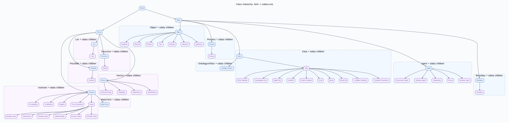

# sdata — Semantic Data Ontology

Ontology suite for Product Passports, Circular Economy, and Digital Twins.

## Status

- Core: `sdata-core-v0.11.0.ttl`
- Foundation: `MIN v2.0.0` (`min-v2.0.0.ttl`)
- OPA: removed (absorbed into MIN v2)
- State Space: `sdata-material-state-v0.5.0.ttl`

## Module overview

- `sdata-core.ttl` (`v0.11.0`)
: 10 classes, 10 object properties, 7 datatype properties.
- `sdata-material-state.ttl` (`v0.5.0`)
: 13 state axes incl. `MethodAxis`, `DomainAxis`, `DataTypeAxis`.
- `shapes/sdata-core-shapes.ttl`
: SHACL checks for example data.

## Core model in 60 seconds

- Base categories come from MIN v2:
  - `min:Object`
  - `min:Process`
  - `min:Data`
  - `min:Agent`
- sdata core classes:
  - Objects: `Material`, `Product`, `Hardware`, `Software`
  - Data: `Data`
  - Agents: `Person`, `HardwareAgent`, `SoftwareAgent`, `Organization`, `EnvironmentAgent`
- Process typing is done with `min:Process`.
: method/domain semantics are modeled via `sms:MethodAxis` and `sms:DomainAxis`.

## Core modeling pattern

```text
Object + Data -> Process -> Object + Data
                  ^
               Agent(s)
           + optional Tool/Software
```

## Namespaces

```turtle
@prefix min:   <https://w3id.org/min#> .
@prefix sdata: <https://w3id.org/sdata/core/> .
@prefix sms:   <https://w3id.org/sdata/material-state/> .
```

## Quickstart

```bash
make setup
make test
make validate
make lint
```

## Visualizations

Build all ontology plots:

```bash
make viz-all
```

Build cross-ontology class hierarchy (MIN -> sdata-core):

```bash
make viz-min-core
```



Build all example plots:

```bash
make viz-examples
```

Build specimen example with dedicated module:

```bash
make viz-specimen
uv run python -m src.visualization.specimen_tensiontest_data_plot
```

Build `min-opa-examples.ttl` via dedicated 3-plot module
(`Object`, `Process`, `Data` modalities):

```bash
make viz-min-opa-examples
uv run python -m src.visualization.min_opa_examples_plot
```

## Migration notes (v0.10.0 -> v0.11.0)

- OPA dependency removed.
- `sdata:Data` moved from Object hierarchy to `min:Data`.
- Core process type is now `min:Process`.
- Core identifier/lifecycle relations are provided by MIN v2.
- sdata keeps only domain-specific relations (`hasMaterial`, `usesTool`, `certifies`, ...).

## Documentation

```bash
uv run --group docs mkdocs build
```
