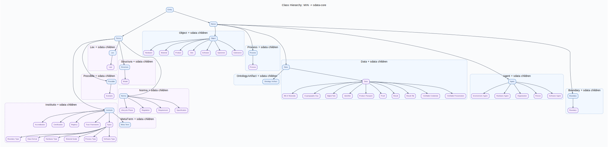

# sdata — Semantic Data Ontology

Ontology suite for Product Passports, Circular Economy, and Digital Twins.

## Status

- Core (default alias): `sdata-core.ttl` (`v0.12.0`)
- Core (latest release): `sdata-core-v0.13.1.ttl`
- Foundation: `MIN v3.4.0` (`min-v3.4.0.ttl`)
- Foundation examples: `examples/min-v3.4.0-examples.ttl`
- State Space: `sdata-material-state-v0.5.0.ttl`
- Quantities: `sdata-quantities.ttl` (`v0.1.1`)

## Module Overview

- `sdata-core.ttl` (`v0.12.0`, lean profile)
: 11 classes, 10 object properties, 7 datatype properties.
- `sdata-core-v0.13.1.ttl` (`extended profile`)
: 35 classes, 21 object properties, 16 datatype properties.
- `sdata-material-state.ttl` (`v0.5.0`)
: 13 state axes including `MethodAxis`, `DomainAxis`, `DataTypeAxis`.
- `sdata-quantities.ttl` (`v0.1.1`)
: AQV + ValueDomain extension on top of `sdata-core` and `MIN`.
- `shapes/sdata-core-shapes.ttl`
: SHACL checks for example data.

## Core Model In 60 Seconds

- Base categories come from MIN:
  - `min:Object`
  - `min:Process`
  - `min:Data`
  - `min:Agent`
  - `min:Forma` with subclasses:
    - `min:Lex`, `min:Structura`, `min:Possibile`, `min:Norma`, `min:Institutio`
- sdata core classes:
  - Objects: `Material`, `Product`, `Hardware`, `Software`
  - Process: `Process`
  - Data: `Data`
  - Agents: `Person`, `HardwareAgent`, `SoftwareAgent`, `Organization`, `EnvironmentAgent`
- `sdata-core-v0.13.1` adds facades for MIN v3 Forma:
  - `Law`, `Model`, `Scenario`, `Requirement`, `Specification`, `Regulation`, `LifecyclePhase`
  - `Certification`, `Accreditation`, `Registry`, `TrustFramework`
  - `Site`, `AssessmentResult` for decentralized custody and claim outcomes
- Process instances are modeled as `sdata:Process` (`subClassOf min:Process`).
: method/domain semantics are typed via `sms:MethodAxis` and `sms:DomainAxis`.

## Core Modeling Pattern

```text
Object + Data -> Process -> Object + Data
                  ^
               Agent(s)
           + optional Tool/Software
```

## Namespaces

```turtle
@prefix min:   <https://w3id.org/min#> .
@prefix sdata: <https://w3id.org/sdata/core/> .
@prefix sms:   <https://w3id.org/sdata/material-state/> .
```

## Quickstart

```bash
make setup
make test
make validate
make lint
```

## Start Reading

- `docs/quickstart.md`
- `docs/modeling-cheatsheet.md`
- `docs/ontologies/MIGRATION-v0.10-to-v0.12.md`
- `docs/ontologies/MIGRATION-v0.12-to-v0.13.md`
- `docs/ontologies/MIGRATION-v0.13.0-to-v0.13.1.md`

## Visualizations

Build all ontology plots:

```bash
make viz-all
```

Build cross-ontology class hierarchy (MIN -> sdata-core):

```bash
make viz-min-core
```



Build interactive class hierarchy (HTML, MIN v3.4.0 + sdata-core):

```bash
make viz-min-core-interactive
```

Output:

- `docs/diagrams/sdata-min-core-hierarchy-interactive.html`

Build all example plots:

```bash
make viz-examples
```

Build specimen example with dedicated module:

```bash
make viz-specimen
uv run python -m src.visualization.specimen_tensiontest_data_plot
```

Build `min-v3.4.0-examples.ttl` via dedicated 3-plot module
(`Object`, `Process`, `Data` modalities; file also contains FORMA examples):

```bash
make viz-min-v3-examples
uv run python -m src.visualization.min_v3_examples_plot
# canonical module:
uv run python -m src.visualization.min_v21_examples_plot
```

## Migration Notes

- `v0.10 -> v0.12`: OPA removed, migration to MIN categories.
- `v0.12 -> v0.13`: expanded sdata facade for MIN v3 (including Forma classes).
- `v0.13.0 -> v0.13.1`: adds custody, registry binding, DPP supersession, and validity/revocation fields.
- `sdata:Data` is `subClassOf min:Data`.
- MIN polarity is schema-level (`min:materialProperty`, `min:informationalProperty`), not instance blank-node aspects.

## Documentation

```bash
uv run --group docs mkdocs build
```
